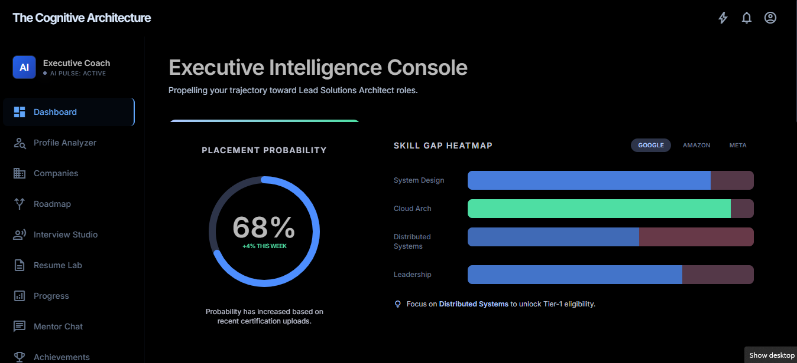
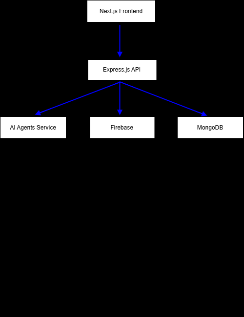
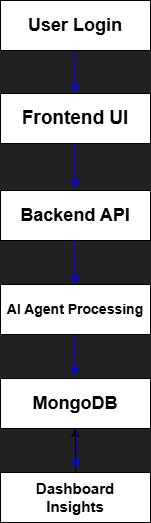

# AI Career Mentor

An intelligent career coaching platform powered by advanced AI agents, designed to guide professionals through comprehensive career development, interview preparation, and skill assessment.


---
## Live Demo

[Visit Live Application]https://mentorshippp.vercel.app/

---

# 📸 Dashboard Preview



---

## Overview

AI Career Mentor combines machine learning, personalized coaching, and interactive features to create an adaptive learning experience. The platform intelligently evaluates your profile, creates customized roadmaps, conducts mock interviews, and provides real-time mentorship.
---

## Key Features

- **Intelligent Profile Analysis** - AI-powered assessment of skills, experience, and career goals
- **Adaptive Roadmaps** - Personalized career development paths based on your profile and aspirations
- **Mock Interview Studio** - Practice interviews with AI evaluation and feedback
- **Career Intelligence** - Company insights and role-specific recommendations
- **Smart Resume Lab** - Resume analysis and optimization suggestions
- **Gamification Elements** - Engagement features to motivate progress
- **Real-Time Mentorship** - Chat interface with AI mentor for guidance
- **Progress Tracking** - Comprehensive analytics and achievement monitoring
---
## System Architecture



---

## Workflow Diagram



---
## Architecture

**Backend (ai_service/)**
- Python-based service with specialized AI agents
- Mentor Agent: Provides guidance and explanations
- Evaluator Agent: Assesses user performance and skills
- Planner Agent: Creates personalized development roadmaps
- LLM Integration: Advanced language models for intelligent responses

**Frontend (client/)**
- Next.js React application
- Responsive design with Tailwind CSS
- Features: Interview prep, profile dashboard, roadmaps, gamification
- Firebase authentication integration

**Server (server/)**
- Express.js backend API
- MongoDB integration for user and progress data
- RESTful endpoints for analysis and user management

---

## Project Structure

```bash
project-root/
│
├── ai_service/              # AI-powered services and agents
├── client/                  # Frontend application
├── server/                  # Backend APIs and business logic
├── assets/                  # README images and diagrams
│
├── README.md
├── DEPLOYMENT.md
├── ENV_VARS.md
├── TROUBLESHOOTING.md
└── LICENSE
```

---

## Getting Started

1. **Backend Setup**
   ```bash
   cd ai_service
   pip install -r requirements.txt
   python main.py
   ```

2. **Frontend Setup**
   ```bash
   cd client
   npm install
   npm run dev
   ```

3. **Server Setup**
   ```bash
   cd server
   npm install
   npm start
   ```

## Environment Variables

Refer to:

- [ENV_VARS.md](ENV_VARS.md)

for complete environment configuration details.

---

## Technology Stack

## Frontend
- React.js
- Next.js
- Tailwind CSS

## Backend
- Node.js
- Express.js

## AI Services
- Python
- LangChain
- LLM Frameworks

## Database & Authentication
- MongoDB
- Firebase

## Deployment
- Vercel
- Render

---

## Additional Documentation

- [Deployment Guide](DEPLOYMENT.md)
- [Environment Variables](ENV_VARS.md)
- [Troubleshooting Guide](TROUBLESHOOTING.md)

---

## Contributing

Contributions are welcome!

1. Fork the repository
2. Create a feature branch
3. Commit your changes
4. Push your branch
5. Open a Pull Request

---

## License

MIT License - see LICENSE file for details
